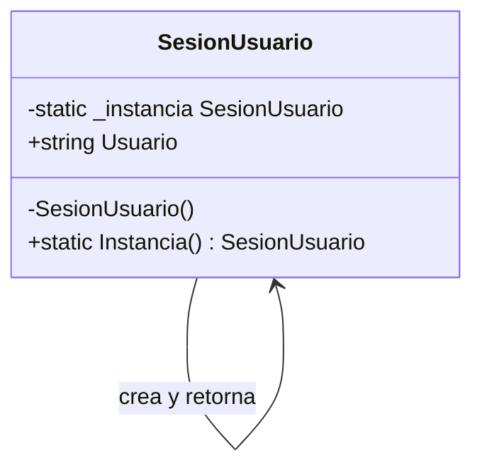

# Singleton

**Categoria:** Creacionales

**Escenario:** El sistema debe tener una unica sesion de usuario, accesible desde cualquier capa.

## Diagrama UML



## Codigo

Ver [`Singleton.cs`](Singleton.cs).

## Como ejecutar

```bash
dotnet run
```
