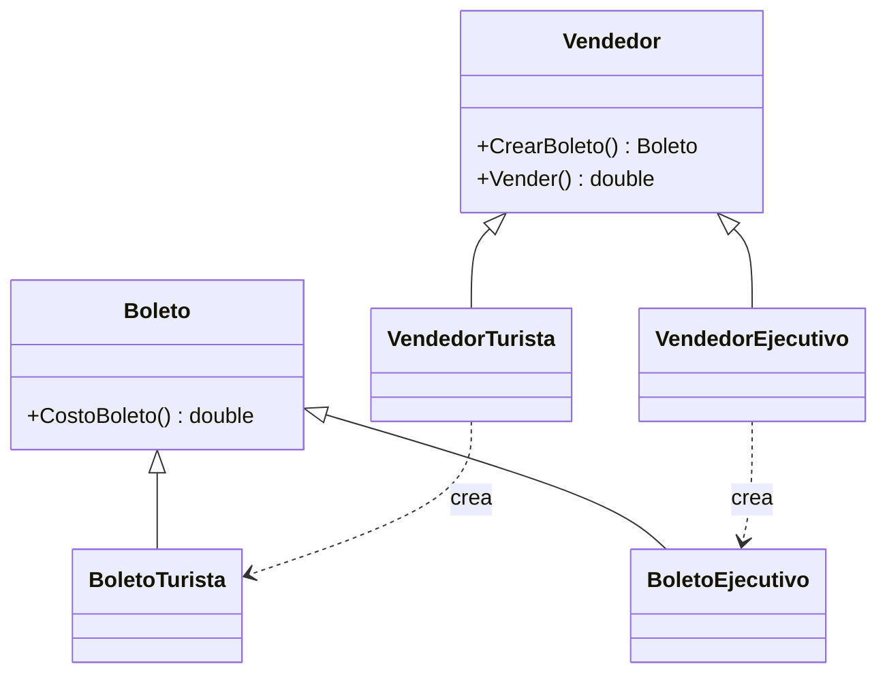

# Factory Method

**Categoria:** Creacionales

**Escenario:** Vender un Boleto cuyo subtipo (Turista/Ejecutivo) no debe instanciar la UI directamente.

## Diagrama UML



## Codigo

Ver [`FactoryMethod.cs`](FactoryMethod.cs).

## Como ejecutar

```bash
dotnet run
```
