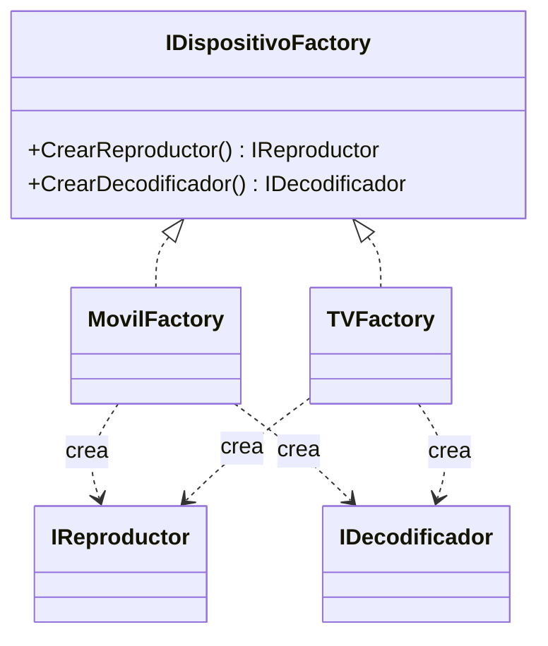

# Abstract Factory

**Categoria:** Creacionales

**Escenario:** Segun el dispositivo (Movil o TV) crear una familia de objetos que van juntos: reproductor y decodificador.

## Diagrama UML



## Codigo

Ver [`AbstractFactory.cs`](AbstractFactory.cs).

## Como ejecutar

```bash
dotnet run
```
