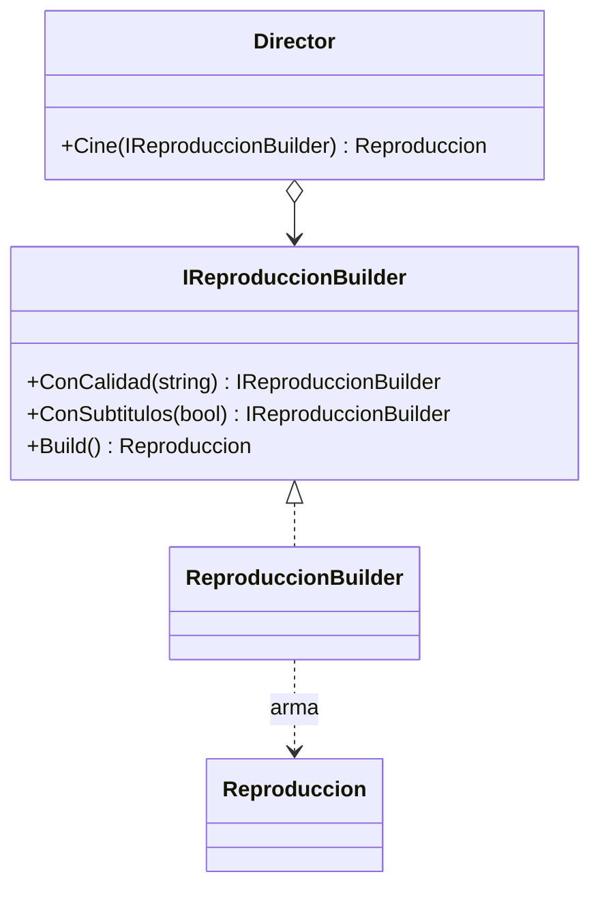

# Builder

**Categoria:** Creacionales

**Escenario:** Armar una configuracion de reproduccion compleja (calidad, subtitulos, idioma) paso a paso.

## Diagrama UML



## Codigo

Ver [`Builder.cs`](Builder.cs).

## Como ejecutar

```bash
dotnet run
```
