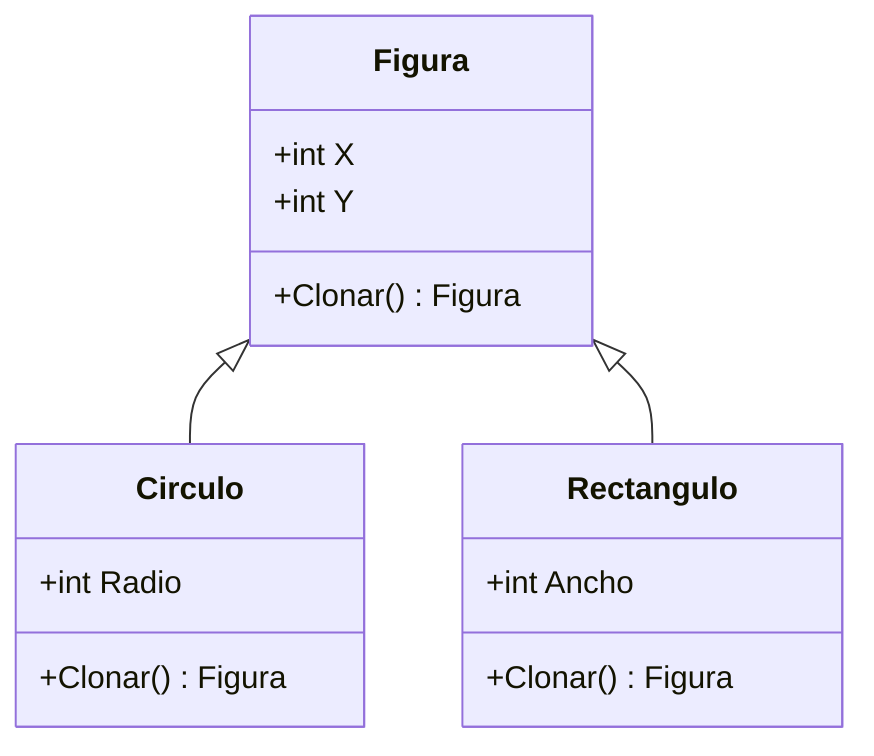

# Prototype

**Categoria:** Creacionales

**Escenario:** Duplicar figuras graficas clonando una existente sin depender de su clase concreta.

## Diagrama UML



## Codigo

Ver [`Prototype.cs`](Prototype.cs).

## Como ejecutar

```bash
dotnet run
```
