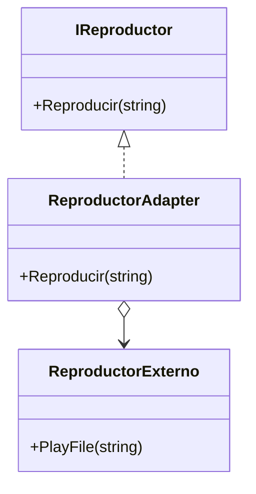

# Adapter

**Categoria:** Estructurales

**Escenario:** El sistema usa IReproductor, pero hay que integrar una libreria externa con otra API (PlayFile).

## Diagrama UML



## Codigo

Ver [`Adapter.cs`](Adapter.cs).

## Como ejecutar

```bash
dotnet run
```
