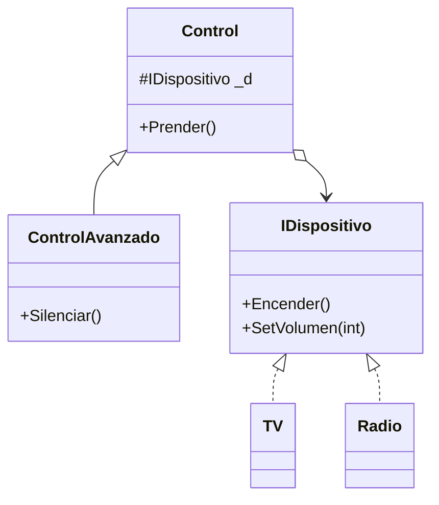

# Bridge

**Categoria:** Estructurales

**Escenario:** Un control remoto (abstraccion) maneja distintos dispositivos (implementacion) sin multiplicar subclases.

## Diagrama UML



## Codigo

Ver [`Bridge.cs`](Bridge.cs).

## Como ejecutar

```bash
dotnet run
```
