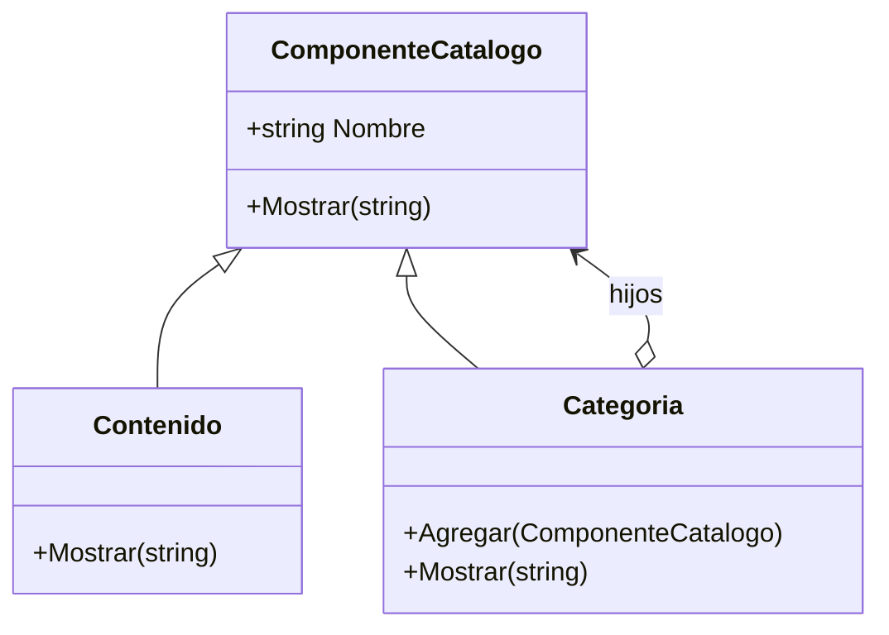

# Composite

**Categoria:** Estructurales

**Escenario:** Un catalogo con categorias que contienen contenidos u otras categorias (arbol).

## Diagrama UML



## Codigo

Ver [`Composite.cs`](Composite.cs).

## Como ejecutar

```bash
dotnet run
```
