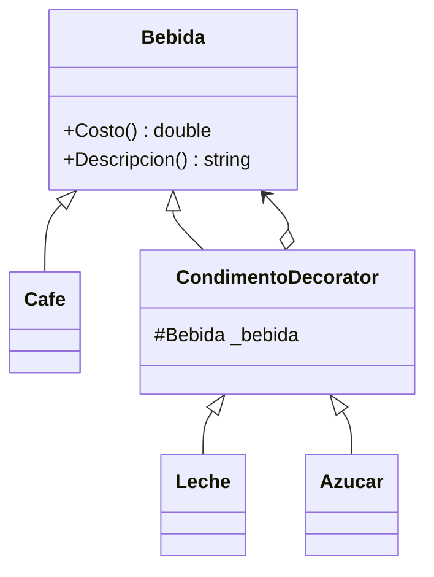

# Decorator

**Categoria:** Estructurales

**Escenario:** Calcular el costo de una bebida base a la que se le agregan condimentos de forma dinamica.

## Diagrama UML



## Codigo

Ver [`Decorator.cs`](Decorator.cs).

## Como ejecutar

```bash
dotnet run
```
