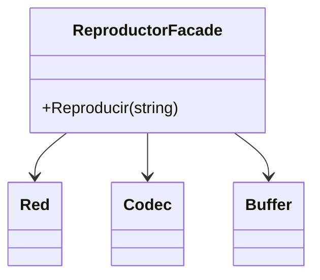

# Facade

**Categoria:** Estructurales

**Escenario:** Reproducir un contenido implica red, codec y buffer. La UI llama a una fachada simple.

## Diagrama UML



## Codigo

Ver [`Facade.cs`](Facade.cs).

## Como ejecutar

```bash
dotnet run
```
