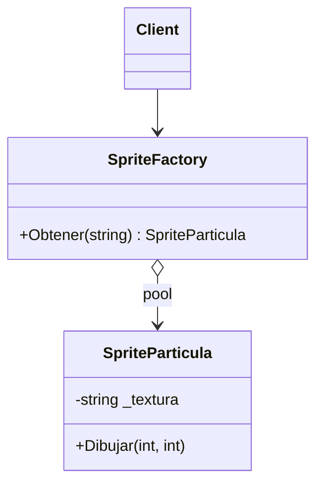

# Flyweight

**Categoria:** Estructurales

**Escenario:** Dibujar miles de particulas que comparten la misma textura (intrinseco) y difieren en posicion (extrinseco).

## Diagrama UML



## Codigo

Ver [`Flyweight.cs`](Flyweight.cs).

## Como ejecutar

```bash
dotnet run
```
