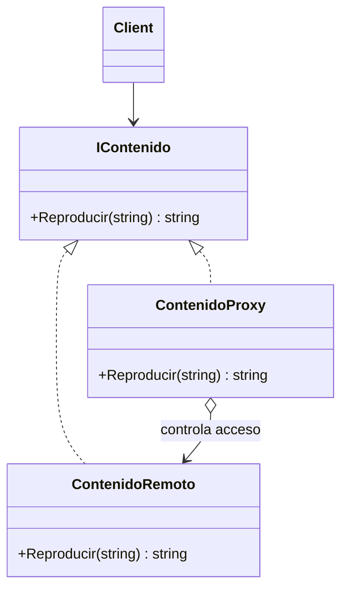

# Proxy

**Categoria:** Estructurales

**Escenario:** El contenido vive en un servidor remoto. El proxy bloquea segun el plan, cachea los ultimos 5 y expone la misma interfaz.

## Diagrama UML



## Codigo

Ver [`Proxy.cs`](Proxy.cs).

## Como ejecutar

```bash
dotnet run
```
