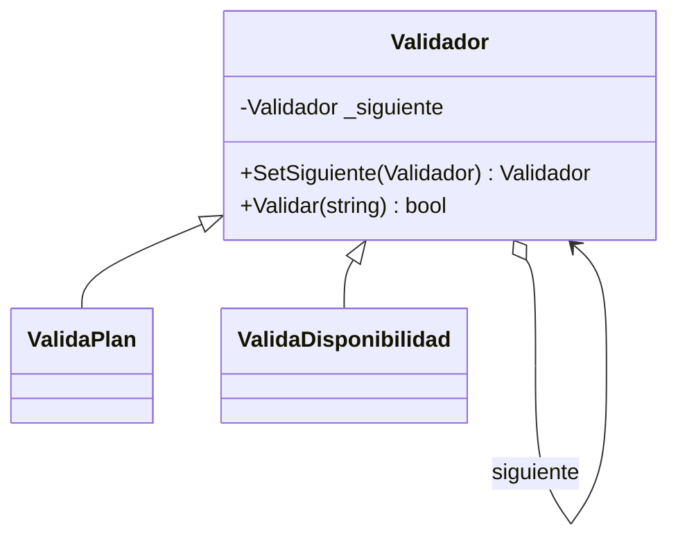

# Chain of Responsibility

**Categoria:** Comportamiento

**Escenario:** Antes de reproducir hay que pasar una cadena de validaciones (plan, disponibilidad...).

## Diagrama UML



## Codigo

Ver [`ChainOfResponsibility.cs`](ChainOfResponsibility.cs).

## Como ejecutar

```bash
dotnet run
```
