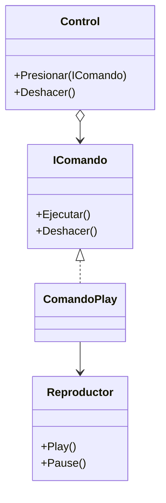

# Command

**Categoria:** Comportamiento

**Escenario:** Los botones del control (play/pause) se encapsulan como comandos, con historial para deshacer.

## Diagrama UML



## Codigo

Ver [`Command.cs`](Command.cs).

## Como ejecutar

```bash
dotnet run
```
