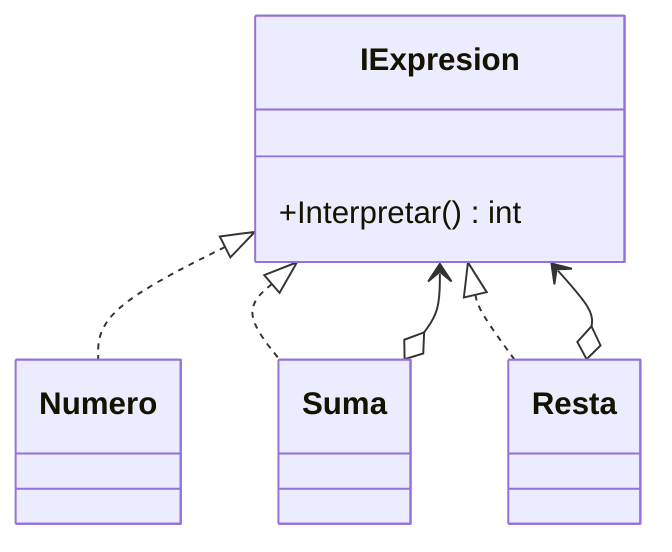

# Interpreter

**Categoria:** Comportamiento

**Escenario:** Evaluar expresiones simples como 'uno mas cinco menos cuatro' y devolver un entero.

## Diagrama UML



## Codigo

Ver [`Interpreter.cs`](Interpreter.cs).

## Como ejecutar

```bash
dotnet run
```
