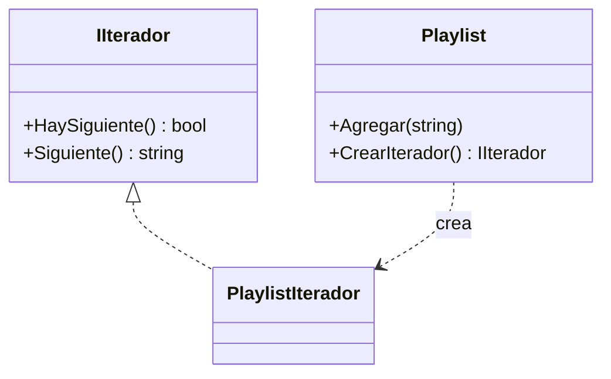

# Iterator

**Categoria:** Comportamiento

**Escenario:** Recorrer una playlist sin exponer como guarda los temas internamente.

## Diagrama UML



## Codigo

Ver [`Iterator.cs`](Iterator.cs).

## Como ejecutar

```bash
dotnet run
```
