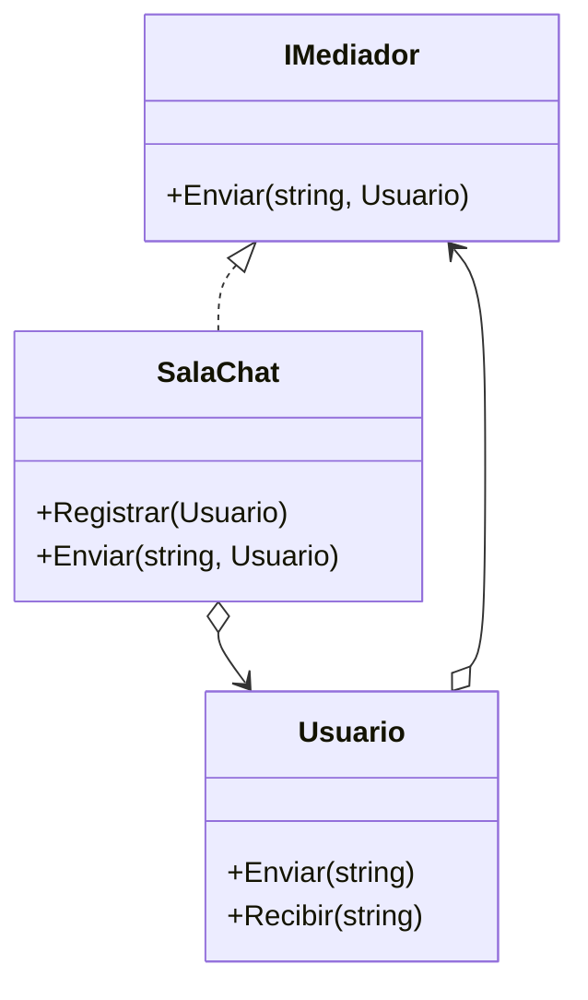

# Mediator

**Categoria:** Comportamiento

**Escenario:** Una sala de chat coordina los mensajes entre usuarios; los usuarios solo hablan con el mediador.

## Diagrama UML



## Codigo

Ver [`Mediator.cs`](Mediator.cs).

## Como ejecutar

```bash
dotnet run
```
