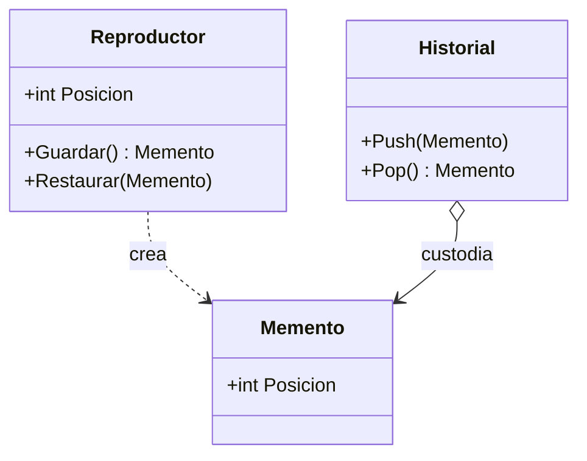

# Memento

**Categoria:** Comportamiento

**Escenario:** Guardar la posicion de reproduccion y poder volver a ella, sin exponer el estado interno.

## Diagrama UML



## Codigo

Ver [`Memento.cs`](Memento.cs).

## Como ejecutar

```bash
dotnet run
```
