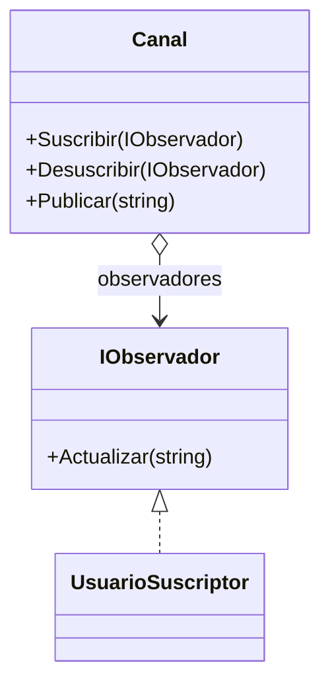

# Observer

**Categoria:** Comportamiento

**Escenario:** Cuando un canal publica un contenido nuevo, todos los suscriptores se enteran automaticamente.

## Diagrama UML



## Codigo

Ver [`Observer.cs`](Observer.cs).

## Como ejecutar

```bash
dotnet run
```
