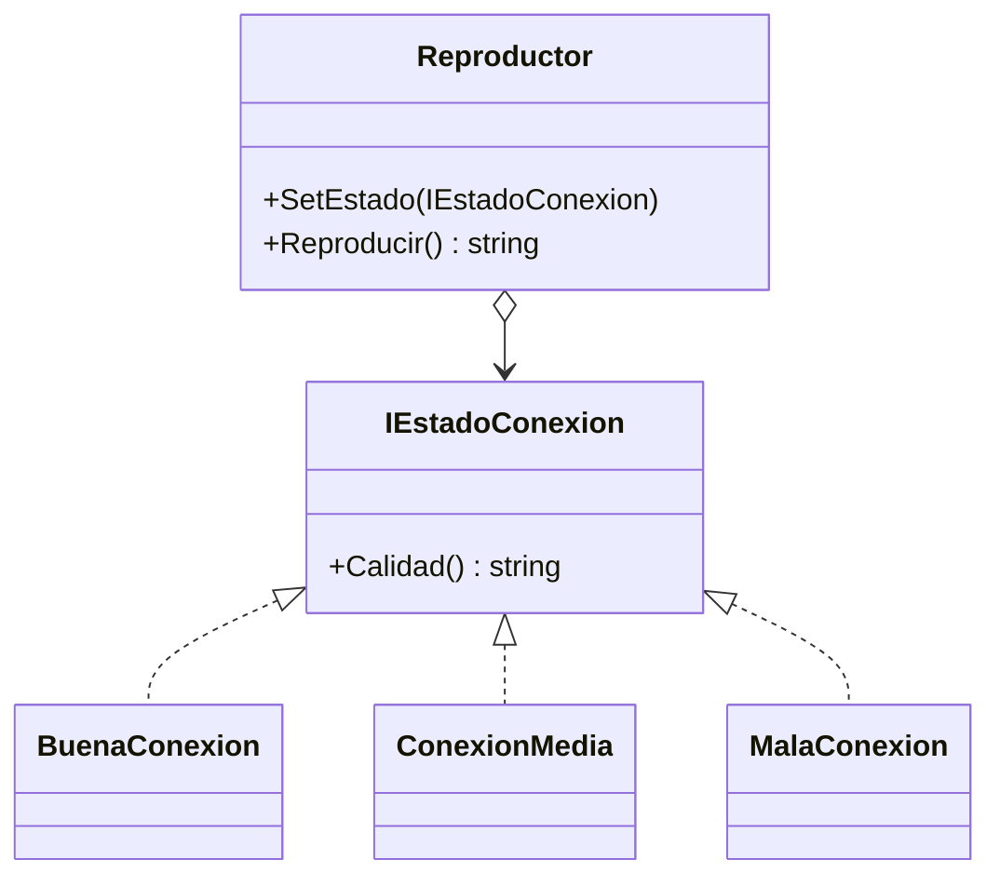

# State

**Categoria:** Comportamiento

**Escenario:** La reproduccion cambia su calidad segun el estado de la conexion, que puede cambiar en runtime.

## Diagrama UML



## Codigo

Ver [`State.cs`](State.cs).

## Como ejecutar

```bash
dotnet run
```
