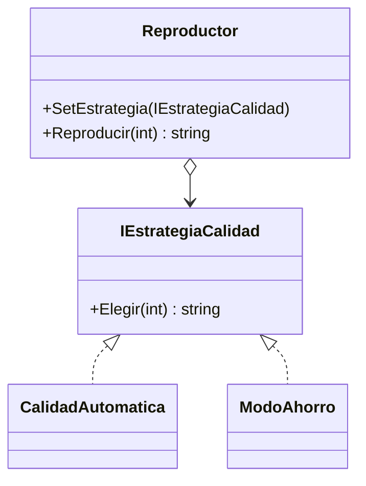

# Strategy

**Categoria:** Comportamiento

**Escenario:** La forma de elegir la calidad es un algoritmo intercambiable: automatica o modo ahorro.

## Diagrama UML



## Codigo

Ver [`Strategy.cs`](Strategy.cs).

## Como ejecutar

```bash
dotnet run
```
