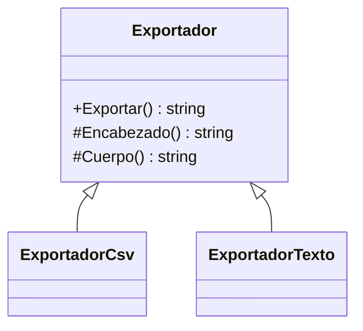

# Template Method

**Categoria:** Comportamiento

**Escenario:** Exportar un listado tiene un esqueleto fijo (encabezado + cuerpo), pero cada formato completa los pasos.

## Diagrama UML



## Codigo

Ver [`TemplateMethod.cs`](TemplateMethod.cs).

## Como ejecutar

```bash
dotnet run
```
