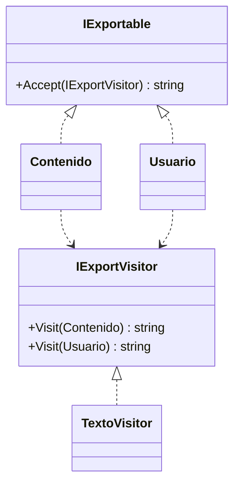

# Visitor

**Categoria:** Comportamiento

**Escenario:** Marketing quiere exportar cualquier listado (contenidos, usuarios...) a texto con una unica rutina.

## Diagrama UML



## Codigo

Ver [`Visitor.cs`](Visitor.cs).

## Como ejecutar

```bash
dotnet run
```
